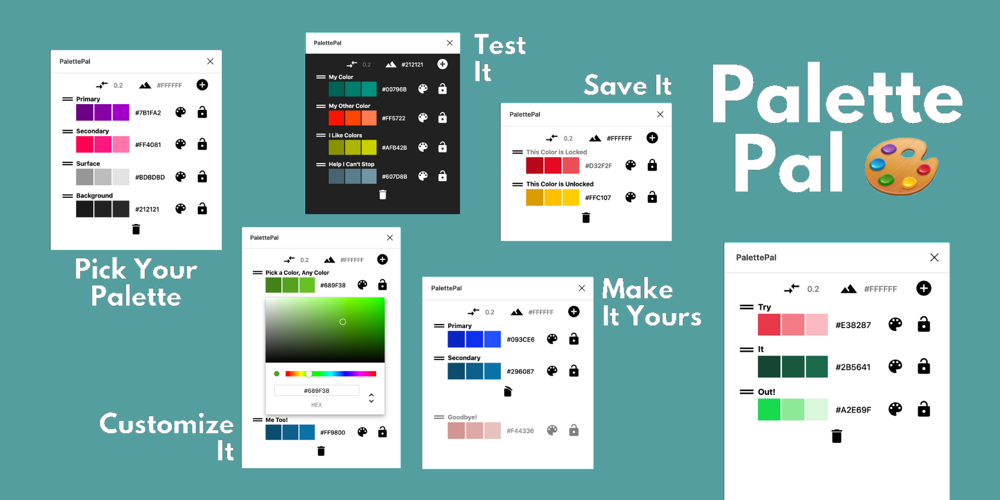

# Palette Pal 🎨

Palette Pal is a plugin for [Figma](https://figma.com) that allows you to keep all your favorite colors in one place.

## How It Works
Running the plugin will display a window where you can add, remove, and edit colors.

Simply edit the color by either editing the hex value or by opening up the color picker.

You can click on the color box to copy the hex value to your clipboard. Or you can save it to your browser's cache by clicking the lock button.

## Additional Features
* Drag to reorder
* Add/Remove colors
* Edit the color of the background to see how well a color works atop another
* Set the difference between the colors

